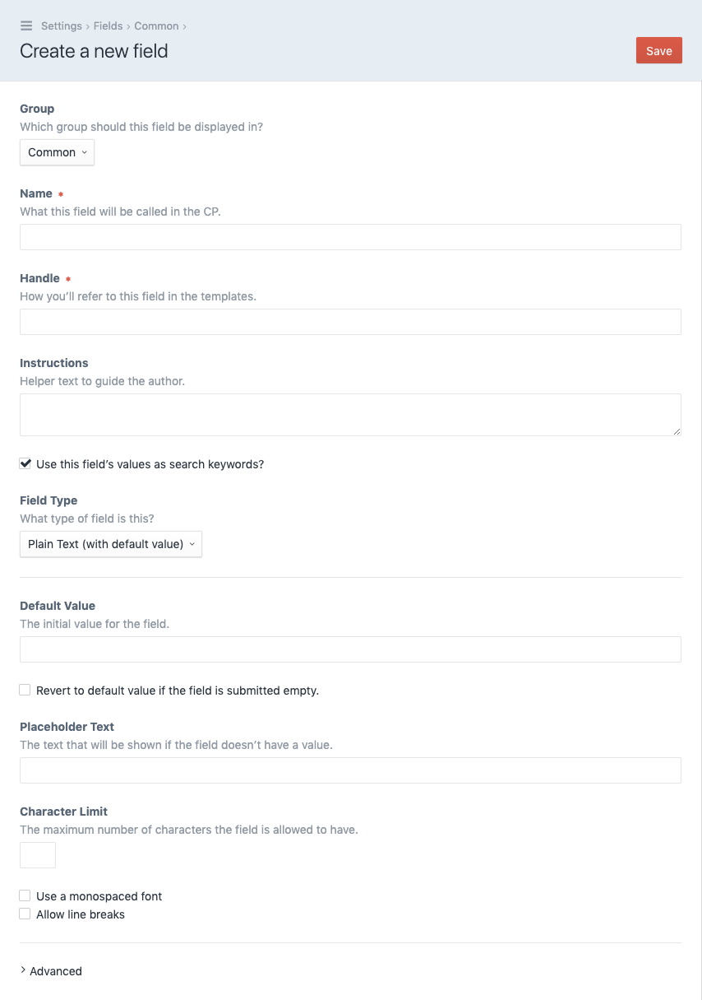
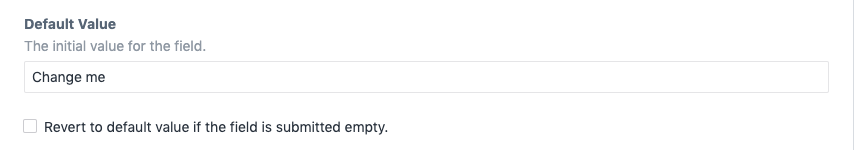
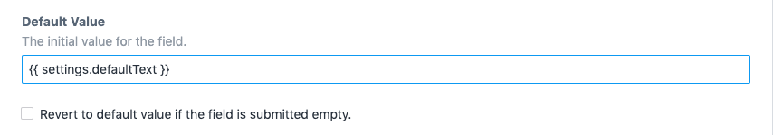
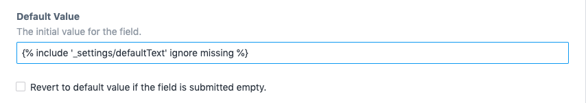

# LJ Default Text plugin for Craft CMS

Adds a Default Value setting to the Plain Text field.

## Requirements

This plugin requires Craft CMS 3.0.0 or later.

## Installation

You can install the plugin via the Craft Plugin Store.

## Overview

This plugin adds the following fieldtype:

- Plain Text (with default value)

## Screenshot

## Useage

Set some default text as an initial value for Plain Text fields.

You can also use Twig to fetch a value from elsewhere.

You can also grab a value from a template file.

Finally, there is a setting to _Revert to default value if the field is submitted empty._ If the user submits an empty field then the initial default value will be submitted instead.

---

Brought to you by [Lewis Jenkins](https://lj.io)
